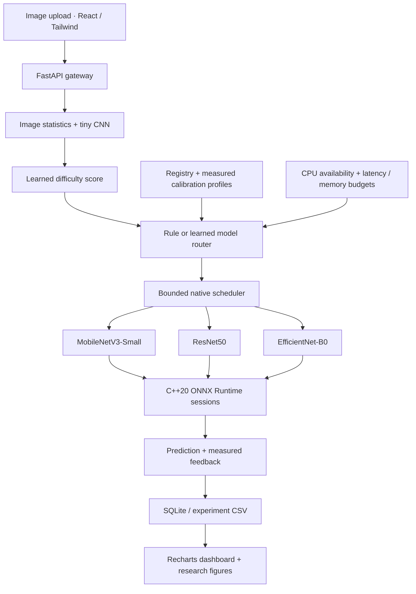

# AdaptiveServe

**Adaptive Deep Learning Model Selection Framework for Resource-Aware Efficient Inference**

A university research prototype that learns to select an ImageNet classifier from
image difficulty and resource context. It combines actual C++ ONNX inference,
PyTorch learning, reproducible experiments, and a React research dashboard.
It measures whether adaptation improves the accuracy–latency tradeoff; it does
not assume or fabricate an improvement.

## Quick start

This checkout is prepared: the three ONNX models, trained analyzer/router,
calibration profiles, measured benchmark and dashboard build are present.
Start it without downloading or retraining:

```bash
.venv/bin/python -m uvicorn adaptiveserve.api:app --host 127.0.0.1 --port 8000
# Open http://127.0.0.1:8000
```

The completed run contains 1,500 measured requests and eight figures. See
[the measured report](docs/results.md) and [verification record](docs/testing.md).
The learned policy did not outperform static MobileNet in this demonstration.
The instructions below also support a fresh installation.

Tested target: Linux x86-64, C++20, Python 3.12, CPU execution. You need CMake,
a compiler, curl, nlohmann-json headers, Node.js 22+ and [uv](https://docs.astral.sh/uv/).
Allow approximately 3 GB for the Python environment, models, dataset and build.

```bash
# Debian / Ubuntu system dependencies
sudo apt-get install build-essential cmake curl nlohmann-json3-dev

# Python dependencies are locked; Torch uses the CPU wheel index.
uv sync --frozen --python 3.12 --extra dev
bash scripts/setup_native.sh

# Reproduce the small demonstration (downloads public data and pretrained weights).
bash scripts/reproduce.sh

# Serve the built dashboard and API together.
.venv/bin/python -m uvicorn adaptiveserve.api:app --host 127.0.0.1 --port 8000
# Open http://127.0.0.1:8000
```

The dashboard works before training and shows explicit setup/empty states.
Prediction requires the artifacts below; there is no mock inference mode.
The first prediction can include session loading. Experiments report warmed
requests and separately record `load_ms`.

## Problem and research motivation

Static deployment pays one model's cost for every input. Images differ in
difficulty, while latency targets and resource availability also vary. A small
analyzer and learned router may avoid expensive inference when a cheaper model
is sufficient. Their own overhead, mistakes, and cached model memory can erase
the benefit. AdaptiveServe makes all of these costs observable.

The research question is: **under which input distributions and resource budgets
does input-dependent selection improve upon static model deployment?**

## Architecture



`adaptive_core` is a pybind11 extension that calls `Ort::Session::Run` directly.
Sessions load lazily and can be unloaded. Execution uses bounded admission and
releases Python's GIL. The native standalone `adaptive_worker` also accepts JSON
lines; see [the native guide](docs/native.md).

## Dataset and pretrained models

The bundled workflow uses [Imagenette](https://github.com/fastai/imagenette), a
10-class ImageNet subset. The mapping from WordNet IDs to ImageNet class indices
is explicit in `adaptiveserve/data.py`. All teachers retain **1,000-class output
heads**; predictions outside the subset count as errors. The 160-pixel download
is resized using each weight's documented preprocessing, so these observations
are not directly comparable to published full-resolution ImageNet scores.

Training and calibration images come from the dataset's training partition;
test images come from its validation partition. Selection is deterministic under
the recorded seed. The small demo uses 300 / 100 / 100 images. Increase these
counts for a stronger study; omit count arguments to use the available data.

The exporter uses torchvision's ImageNet V1 weights for MobileNetV3-Small,
ResNet50 and EfficientNet-B0, validates ONNX/PyTorch logits, and records the
required interpolation/resize/crop configuration. Published reference scores
are not inserted into the registry as local measurements. See the
[torchvision model documentation](https://docs.pytorch.org/vision/stable/models.html).

For your own ImageNet subset, supply CSV columns `sample_id,path,label,split`.
Image paths are relative to the manifest; labels are integer ImageNet indices
0–999; split is `train`, `calibration` or `test`. See
[module examples and expected outputs](docs/testing.md). CIFAR-100 requires
fine-tuning all three classification heads and updating the label mapping;
ImageNet heads cannot be evaluated directly against CIFAR labels.

## Methodology and algorithms

1. **Profile teachers.** Run every training and calibration image through all
   three exported models in separate processes. Record prediction, true-class
   probability, latency, process CPU and RSS. Calibration images alone define
   model profiles used for feasibility checks.
2. **Learn difficulty.** A two-convolution CNN produces an image embedding,
   fused with six statistics: resolution, aspect ratio, entropy, edge density,
   texture and noise. A sigmoid output predicts the average true-class
   probability deficit across the three teachers. This is a supervised proxy
   for classification difficulty, not a ground-truth measure of visual complexity.
3. **Threshold baseline.** Complexity below 0.4 prefers MobileNetV3; below 0.7
   prefers ResNet50; otherwise EfficientNet-B0. Infeasible preferences fall back
   to the highest measured accuracy feasible model. The ordering is the requested
   baseline; it is not a claim that these architectures have monotonic accuracy.
4. **Learned router.** A small MLP takes predicted difficulty, latency budget,
   CPU availability, and memory budget. Training labels choose among measured
   teacher outcomes using correctness and observed costs under sampled resource
   budgets. A feasibility mask prevents choosing an infeasible candidate when
   a feasible one exists. If none fits, the fastest fallback explicitly reports
   a constraint violation. See checkpoint metadata for the exact target policy.
5. **Evaluate.** Each static model, the threshold router and the learned router
   process the same held-out images. Adaptive timing includes analysis and
   selection. Test IDs are checked against training and calibration provenance.

Resource budgets and CPU availability in controlled experiments are **routing
contexts**, not operating-system limits or simulated measurements. Profiles do
not predict queueing or nonlinear contention. Live requests use observed host
CPU availability. A profile-feasible selection can still miss its measured
end-to-end budget; responses expose both outcomes. Adaptive sessions remain
cached, so process memory can exceed a single selected model's calibration RSS.

## Reproduce each stage

Run from the repository root after environment setup:

```bash
# Dataset and model export
.venv/bin/python scripts/prepare_data.py --train-count 300 --calibration-count 100 --test-count 100 --seed 42
.venv/bin/python scripts/export_models.py

# Measure actual training/calibration predictions; never profile the test split.
.venv/bin/python -m experiments.profile --threads 1 --warmup 3 --seed 42

# Train both artifacts using training observations only.
.venv/bin/python scripts/train.py --complexity-epochs 30 --router-epochs 200 --seed 42

# Five policies × identical test images × three repetitions.
.venv/bin/python -m experiments.evaluate --threads 1 --warmup 3 --repeats 3 --seed 42

# Change the routing budget for a separate, explicitly identified run.
.venv/bin/python -m experiments.evaluate --latency-budget-ms 15 --memory-budget-mb 1024 --cpu-available 0.5 --output results/constrained

# Regenerate the eight figures from saved observations.
.venv/bin/python -m experiments.plot --results results/latest --output frontend/public/results
```

The default backend is `cpp`. `--backend python` explicitly selects the Python
ONNX Runtime adapter for portability/debugging; profile and evaluate with the
same backend and identify those runs separately. It is never silently selected.

The runner saves `results/latency.csv`, `accuracy.csv`, `memory.csv`, and
`model_selection.csv`, plus complete observations, summaries, confidence
intervals, model/source hashes and machine configuration under `results/latest/`.
All eight PNG figures in `frontend/public/results/` are derived from those files.
Inference feedback is stored in `history/feedback.sqlite`; experiments use a
separate `history/benchmark.sqlite`.

Accuracy intervals use a Wilson 95% interval over unique images; timing repeats
do not inflate the accuracy sample count. Throughput is sequential batch-one
wall throughput, including image decode and feedback recording. It is not a
concurrent-load capacity measurement. Memory is whole-process RSS in MiB,
measured with a separate process per policy; adaptive policies cache all three
sessions. Request CPU percentages use one core = 100%; live host CPU is 0–100%.

## Dashboard and inference

The dashboard provides image upload/prediction, model registry, live monitoring,
research results, and an interactive architecture diagram. Registry statistics
remain blank until profiling. Results remain empty until evaluation completes.

```bash
# API (the built frontend is served at the same address)
.venv/bin/python -m uvicorn adaptiveserve.api:app --host 127.0.0.1 --port 8000

# In a second terminal, frontend development with /api proxying to port 8000
cd frontend
npm ci
npm run dev

# Upload your own image from another terminal
curl -F 'file=@/absolute/path/to/image.jpg' -F 'policy=learned' \
     -F 'latency_budget_ms=50' -F 'memory_budget_mb=2048' \
     http://127.0.0.1:8000/api/predict
```

API documentation is at `/docs`. The response includes difficulty, selected
model, selection reason, class, confidence, analyzer/ONNX/total latency, resource
measurements, backend, and constraint status. Confidence is softmax probability,
not calibrated confidence. Uploads are limited to 10 MiB and 20 megapixels.

## Testing and deployment

```bash
.venv/bin/python -m pytest -q
.venv/bin/python scripts/verify_demo.py
ctest --test-dir build --output-on-failure
cd frontend
npm test -- --run
npm run build
cd ..
docker compose config --quiet
docker compose up --build
```

Compose serves port 8000 on localhost and mounts locally generated models,
registry, feedback, results and figures. Prepare/train on the host first.
The Dockerfile includes the native SDK build and frontend production build.
This is a local research deployment; it does not implement distributed scaling.
See [test inputs, expected outputs and verification](docs/testing.md).

## Results and interpretation

Inspect `results/latest/summary.json`, the dashboard, and the retained
[demonstration report](docs/results.md) for measurements from this checkout.
Positive latency reduction means AdaptiveServe was faster than that baseline;
negative means slower. Always read the accuracy difference alongside latency.
A speedup relative to ResNet50 does not prove superiority over MobileNetV3, and
an input-aware router may collapse to one choice if its training signal is weak.

The contribution is an inspectable experimental implementation: a supervised
difficulty signal, context-conditioned selection, real native execution,
explicit adaptive overhead, and a reproducible baseline comparison. It is not
a new state-of-the-art claim or proof of global optimality.

## Comparison with INFaaS

[INFaaS (USENIX ATC 2021)](https://www.usenix.org/conference/atc21/presentation/romero)
is a distributed inference system that chooses model variants, hardware and
optimizations, and combines model-level and VM-level autoscaling. AdaptiveServe
is a small single-host research prototype focused on per-image difficulty and
learned selection among three classifiers. It does not reproduce INFaaS's
distributed hardware allocation, model-variant generation, autoscaling, or
reported cloud cost results. INFaaS is a related-work reference, not a measured
baseline in this repository.

## Future work

Use larger held-out datasets and multiple seeds; evaluate difficulty prediction
on shifted distributions; compare a calibrated confidence cascade and an oracle
upper bound; add measured concurrency and hardware stress; learn contextual
bandit policies from delayed labels; account for cache eviction and model load
costs; add energy measurement; retrain/fine-tune all heads for CIFAR-100. Tune
policy hyperparameters on validation data before the final test run.

## Folder structure

```text
AdaptiveServe/
├── adaptiveserve/
│   ├── api.py                 # HTTP endpoints, uploads, result serving
│   ├── service.py             # analyzer → router → one real model
│   ├── runtime.py             # shared preprocessing and explicit backends
│   ├── feedback.py            # SQLite feedback and aggregates
│   ├── data.py                # ImageNet labels and deterministic manifests
│   ├── features.py            # six image statistics
│   ├── complexity.py          # CNN difficulty model/checkpoints
│   ├── routing.py             # constrained threshold and learned routers
│   ├── training.py            # measured targets and reproducible training
│   └── export.py              # pretrained ONNX export/parity
├── core/
│   ├── inference/             # ONNX sessions and execution
│   ├── registry/              # validated model metadata
│   ├── router/                # native threshold router
│   ├── scheduler/             # bounded execution admission
│   ├── monitor/               # CPU, RSS and timing
│   ├── python/                # pybind11 gateway
│   └── utils/                 # structured JSON logging
├── workers/onnx/              # persistent JSON-line native worker
├── configs/models.json        # export metadata; unmeasured stats are null
├── models/                    # ONNX models, labels, trained .pt, profiles
├── data/                      # ignored downloaded images and manifest
├── experiments/
│   ├── common.py              # input checks and provenance
│   ├── profile.py             # isolated teacher measurements
│   ├── evaluate.py            # five-policy held-out comparison
│   └── plot.py                # eight figures from actual observations
├── frontend/                  # React, Tailwind, Recharts, Vitest
│   └── public/results/        # generated research figures
├── scripts/                   # setup, export, data, training, reproduction
├── tests/                     # Python and C++ module/integration tests
├── results/                   # observations, required CSVs, summaries
├── history/                   # persistent feedback databases and logs
├── docs/                      # design, native guide, results, review script
├── CMakeLists.txt
├── pyproject.toml / uv.lock
└── Dockerfile / compose.yaml
```

For a three-minute professor review, follow [the demo script](docs/professor-review.md).
